# kubernetis-dz11
"Обновление приложений"

# Домашнее задание к занятию «Обновление приложений»

### Цель задания

Выбрать и настроить стратегию обновления приложения.

### Чеклист готовности к домашнему заданию

1. Кластер K8s.

### Инструменты и дополнительные материалы, которые пригодятся для выполнения задания

1. [Документация Updating a Deployment](https://kubernetes.io/docs/concepts/workloads/controllers/deployment/#updating-a-deployment).
2. [Статья про стратегии обновлений](https://habr.com/ru/companies/flant/articles/471620/).

-----

### Задание 1. Выбрать стратегию обновления приложения и описать ваш выбор

1. Имеется приложение, состоящее из нескольких реплик, которое требуется обновить.
2. Ресурсы, выделенные для приложения, ограничены, и нет возможности их увеличить.
3. Запас по ресурсам в менее загруженный момент времени составляет 20%.
4. Обновление мажорное, новые версии приложения не умеют работать со старыми.
5. Вам нужно объяснить свой выбор стратегии обновления приложения.

Ответ:

Разберем ограничение влияющее на принятое решения.

Ограничение №1:

 «Обновление мажорное (— это глобальное или крупное обновление программного обеспечения, обновляет интерфейс и архитектуру), новые версии приложения не умеют работать со старыми»

Стратегии Blue-green, Canary и A/B-тест предполагают, что будет происходить «Одновременное развёртывание старой и новой версий приложения».  Если версии несовместимы (например, изменилась схема базы данных или API), их одновременная работа приведет к ошибкам или искажеии данных. При Rolling update K8s заменяют поды, значит в кластере одновременно будут работать поды со старой и новой версией, что нарушает условие несовместимости.

Рассматривая Recreate и согласно материалам лекции, видим что стратегия, когда все старые поды одновременно удаляются и заменяются новыми и старая и новая версии никогда не пересекаются в работе - подходит больше всего.

Ограничение №2: «Ресурсы ограничены и запас составляет 20%»
Не подходят: 
 Blue-green и Canary нам потребуется 100% дополнительных ресурсов для создания зеркальной копии. 
 Rolling update по умолчанию используется maxSurge: 25%, что означает создание дополнительных подов сверх лимита. При запасе всего в 20% кластер упрется в нехватку CPU/RAM, и новые поды уйдут в статус Pending, а обновление зависнет.

Подходит Recreate. 
Рассмотрение алгоритма:
- указываю образ новой версии deployment
- в k8s кластере уничтожаю все поды со старой версией
- добавляю поды c новой версией

Стратегия не требует дополнительных ресурсов, на этапе уничтожения старых подов ресурсы временно освобождаются, что с запасом укладывается в 20%.

Итог:  Берем Тех.окно для обновление, как на Московской бирже в выходные, используем Recreate.

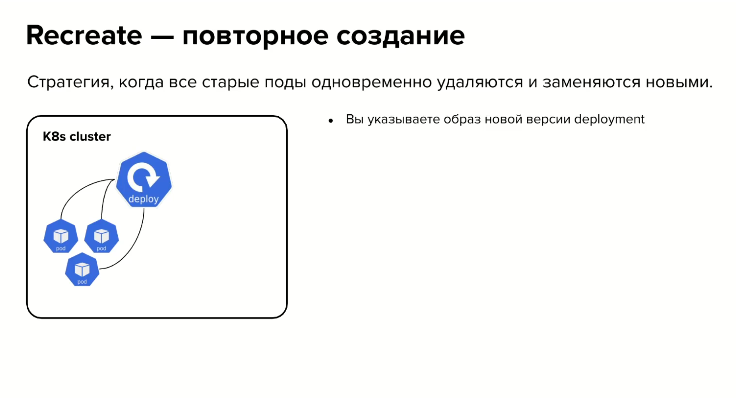

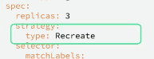


### Задание 2. Обновить приложение

1. Создать deployment приложения с контейнерами nginx и multitool. Версию nginx взять 1.19. Количество реплик — 5.

Создадим манифест:
[text](app-deployment.yaml)

2. Обновить версию nginx в приложении до версии 1.20, сократив время обновления до минимума. Приложение должно быть доступно.

В манифесте выше
nginx:1.19 + multitool, 5 реплик

Применяем:
```
kubectl apply -f app-deployment.yaml
```
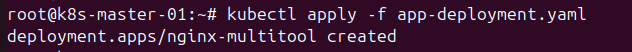

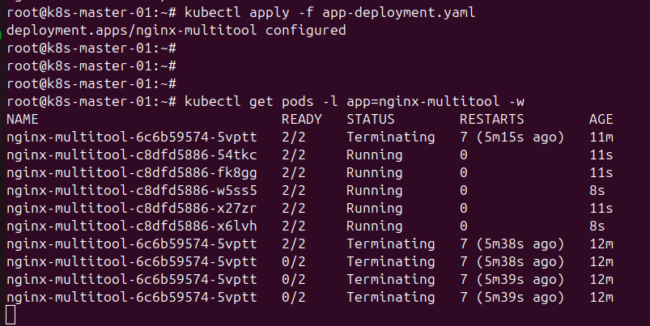

Будем обновлять:
План обновления:
```
maxSurge: 1 (20%) — создаётся 1 новый под за цикл обновления
maxUnavailable: 1 (20%) — 1 под может быть недоступен в процессе работы и обновления
Постараемся увидеть: 5 этапов обновления, всегда 4 пода должны быть доступны
```
Применяем новую стратегию обновления:
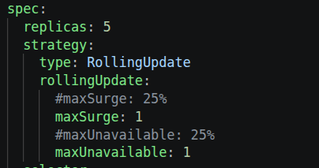

Обновляем:

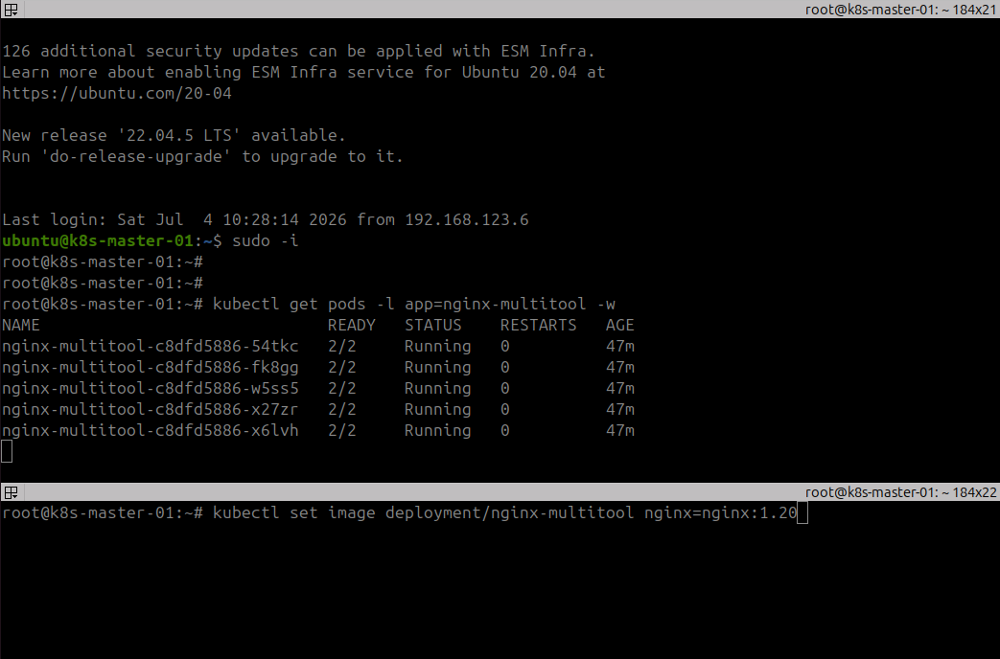

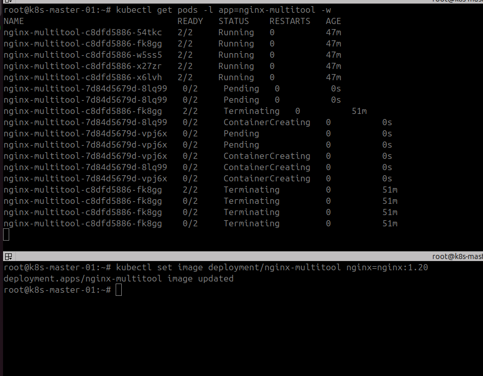

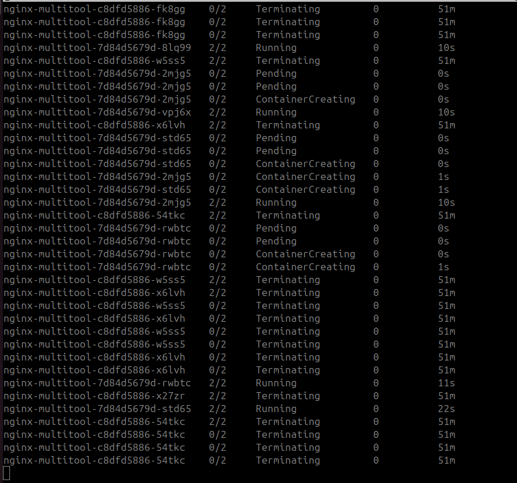

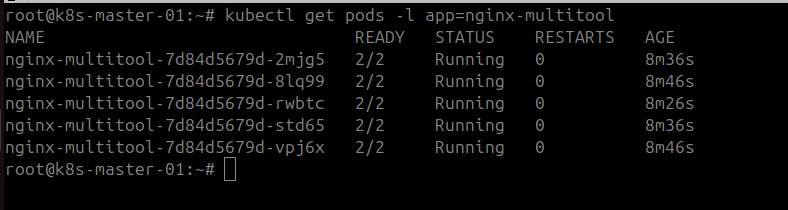

Обновление до версии 1.20 завершено успешно
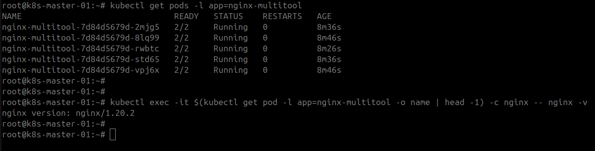

3. Попытаться обновить nginx до версии 1.28, приложение должно оставаться доступным.

Обновление до не существующей версии, верхней командой просматриваем процесс обновления, нижней запускаем. Rollout должен зависнуть на первом этапе.

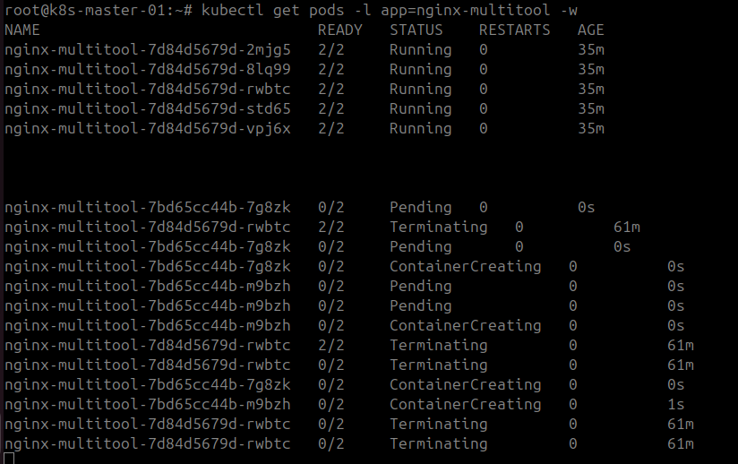

:-)  Обновились ))

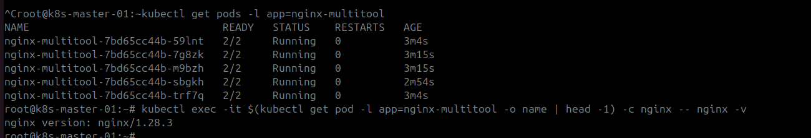

Повышаем версию обновления выше существующей крайней...

Актуальная версия Nginx зависит от выбранной ветки разработки:1.30.3 — последняя стабильная (Stable) версия. Она содержит только проверенные функции и важные исправления безопасности. Рекомендуется для production-сред.1.31.2 — последняя основная (Mainline) версия. В неё добавляются все новые возможности и эксперименты.Оба этих релиза вышли одновременно и закрывают критические уязвимости безопасности (включая переполнения буфера в прокси-модулях).

Обновим до 1.33

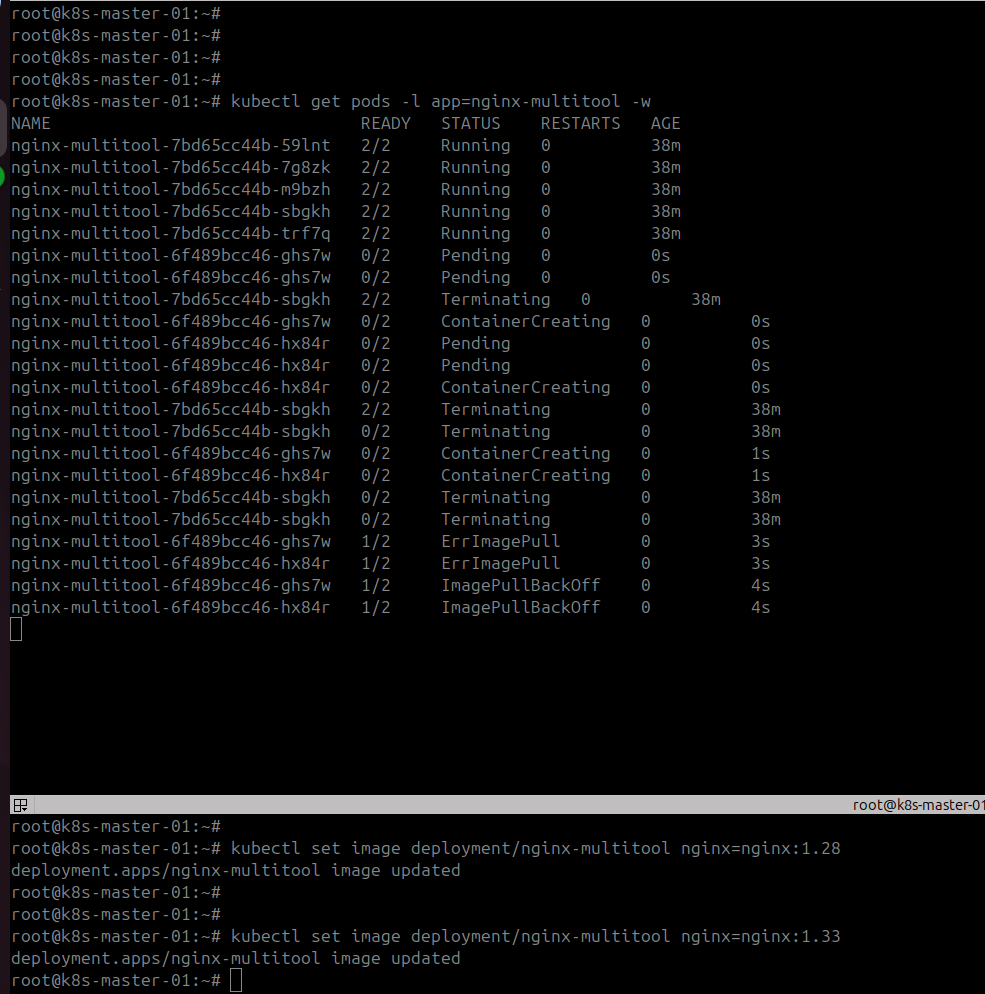

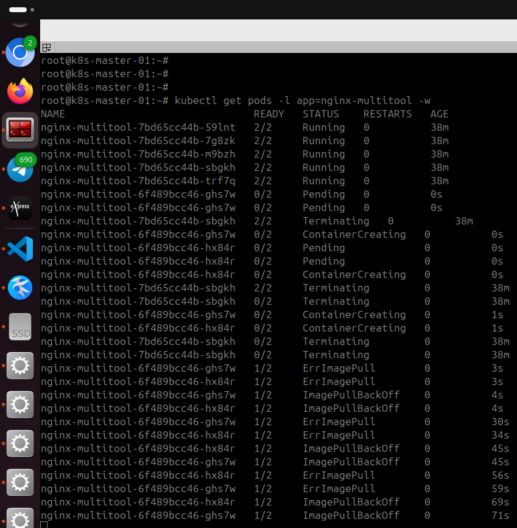


Видим ErrImagepool  и  BackOff, проверяем состояние:

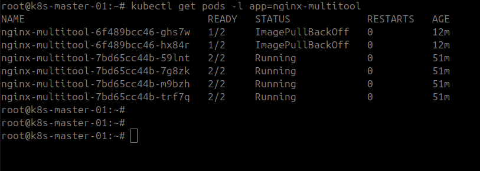

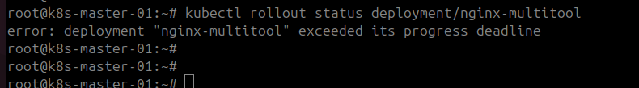

Более детально:
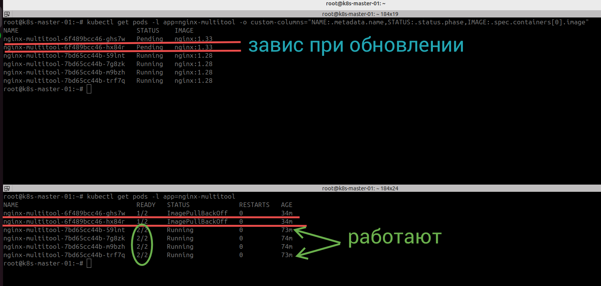

nginx-multitool-6f489bcc46-hx84r
nginx-multitool-6f489bcc46-ghs7w

Статус контейнеров:
kubectl get pods -l app=nginx-multitool -o custom-columns="NAME:.metadata.name,READY:.status.containerStatuses[*].ready,STATE:.status.containerStatuses[*].state"


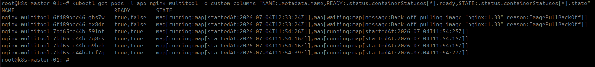


4. Откатиться после неудачного обновления.

Команда:
```
kubectl rollout undo deployment/nginx-multitool
```

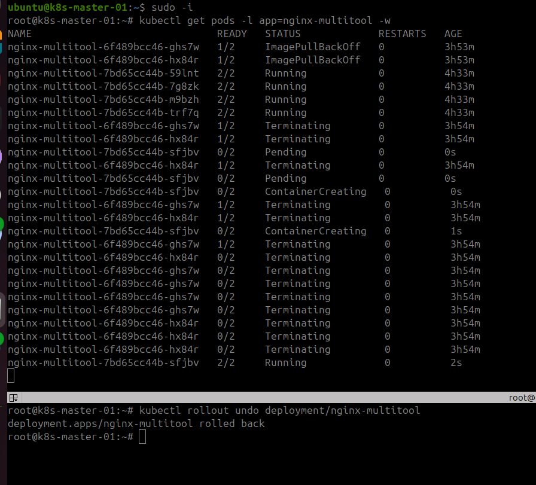

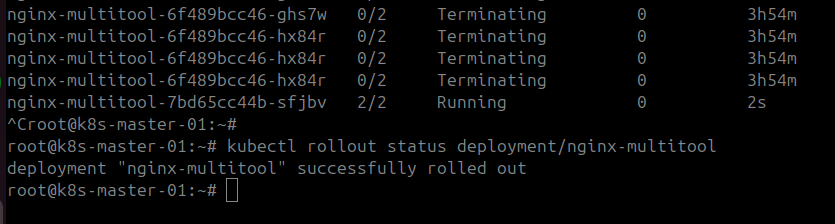

Итог - восстановлено:
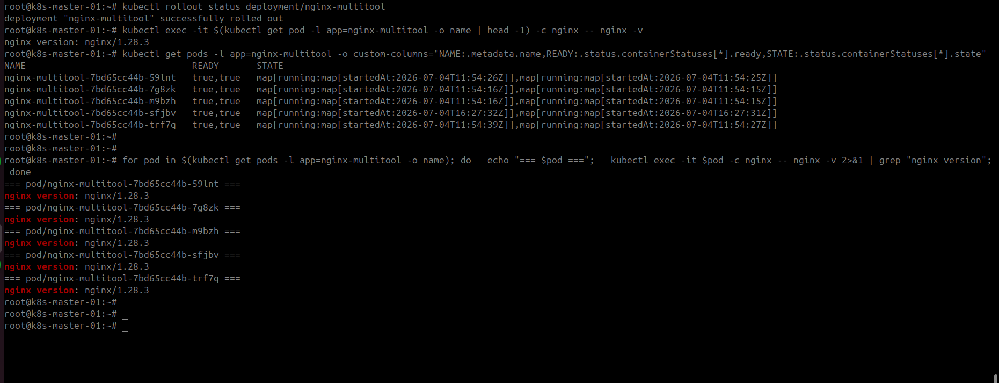


## Дополнительные задания — со звёздочкой*

Задания дополнительные, необязательные к выполнению, они не повлияют на получение зачёта по домашнему заданию. **Но мы настоятельно рекомендуем вам выполнять все задания со звёздочкой.** Это поможет лучше разобраться в материале.   

### Задание 3*. Создать Canary deployment

1. Создать два deployment'а приложения nginx.

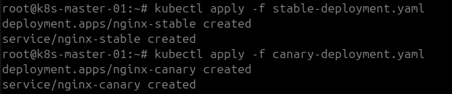

Stable Deployment (5 реплик) + Service

[stable-deployment.yaml](stable-deployment.yaml)

Canary Deployment (1 реплика) + Service

[text](canary-deployment.yaml)


2. При помощи разных ConfigMap сделать две версии приложения — веб-страницы.

Два ConfigMap с разными веб-страницами

[text](canary-configmaps.yaml)

3. С помощью ingress создать канареечный деплоймент, чтобы можно было часть трафика перебросить на разные версии приложения.

Основной Ingress + Canary Ingress

[text](canary-ingress.yaml)


Применяем ConfigMap
```
kubectl apply -f canary-configmaps.yaml
kubectl get configmap nginx-stable-page nginx-canary-page
```
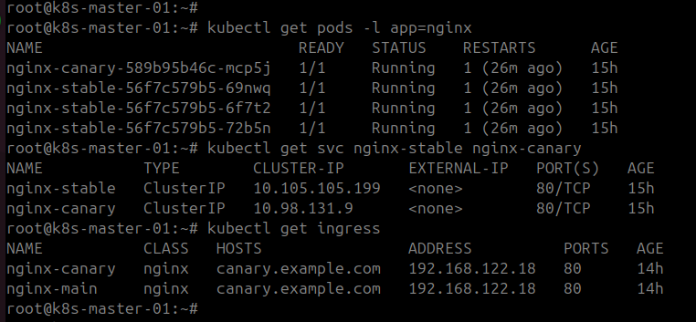

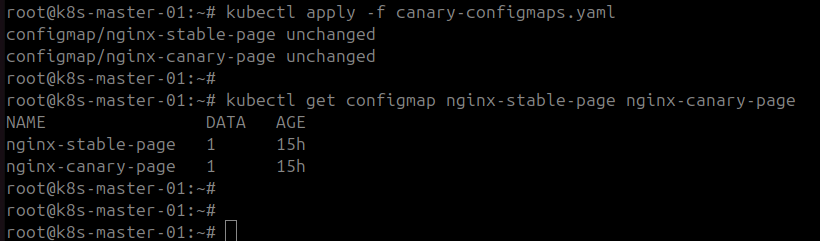

```
for i in {1..20}; do
  curl -s -H "Host: canary.example.com" http://192.168.122.11:30647 | grep "<h1>"
done
```

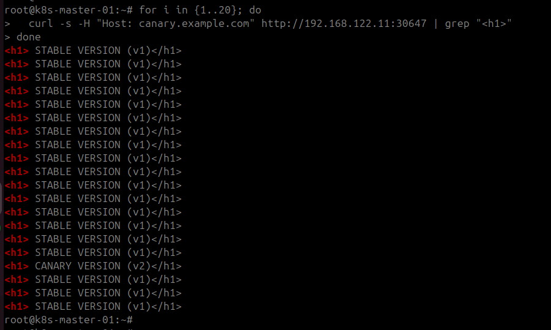

Итого:  Ингресс нормально настроил Канарейку, на выводе сайтов виден один экземпляр канареечного приложение с более высокой версией.


### Правила приёма работы

1. Домашняя работа оформляется в своем Git-репозитории в файле README.md. Выполненное домашнее задание пришлите ссылкой на .md-файл в вашем репозитории.
2. Файл README.md должен содержать скриншоты вывода необходимых команд, а также скриншоты результатов.
3. Репозиторий должен содержать тексты манифестов или ссылки на них в файле README.md.


